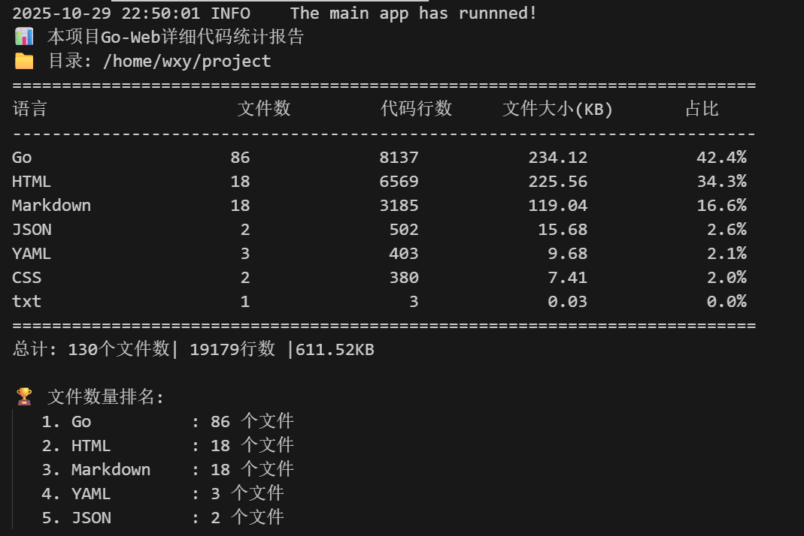

# Go Web 应用项目

## 项目简介

这是一个基于Go语言开发的综合性Web应用，集成了多种实用功能模块，包括用户认证、汇率查询、天气信息、游戏系统、文章管理、翻译服务等。项目采用前后端分离架构，后端基于RESTful API设计，前端使用HTML模板渲染，实现了高性能、可扩展的Web服务。

## 技术栈
- **Go的标准库**：encoding/json、os、io、context、containers、strconv、container等go标准库
- **后端框架**: Gin (高性能Go Web框架)
- **ORM**: GORM (Go语言ORM库)
- **数据库**: MySQL (主数据库)
- **缓存**: Redis (缓存和会话存储)
- **日志**: Zap (高性能日志库)
- **API文档**: Swagger (自动生成API文档)
- **认证**: JWT (JSON Web Token)
- **中间件**: 自定义日志、恢复、认证、权限控制中间件
- **翻译服务**: 集成大模型(OpenAI风格)实现多语言翻译,这里采用的是Kimi K2模型
- **地图服务**: 高德地图API集成并加以定位

## 功能特性

### 用户系统
- 用户注册、登录、登出
- JWT认证机制
- 角色权限管理（普通用户、管理员、超级管理员）
- 用户信息管理

### 汇率查询
- 实时汇率数据获取
- 人民币汇率Top10排行
- 汇率数据可视化展示
- 手动刷新汇率数据

### 天气信息
- 城市天气数据获取
- Top10城市天气排行
- 用户地理信息的定位
- 地理位置相关天气信息
- 空气质量指数(AQI)展示

### 游戏系统
- **猜数字游戏**: 三轮递增难度的数字猜测游戏，每轮猜测次数递减
- **地图时间挑战游戏**: 三轮递增难度的地图路径寻找游戏，记录完成时间
- 游戏排行榜系统
- 个人成绩追踪与历史记录
- 实时游戏状态管理

### 文章管理
- 文章列表展示
- 文章详情页面
- 文章点赞功能

### 翻译服务
- 基于Kimi K2模型的多语言翻译
- 支持20+种语言互译
- 自动语言检测
- 翻译历史记录管理
- 翻译使用限制(防滥用)

### 系统监控
- 文件系统实时监控
- 资源使用情况监控
- 日志文件变化追踪
- 系统状态可视化展示
- 
### 其他功能
- 图片代理服务
- Shell命令执行界面(管理员功能)
- 管理员仪表板
- 用户地理位置获取
- 响应式UI设计

## 项目结构

```
project/
├── config/          # 配置文件和配置处理
│   ├── config.go    # 配置初始化
│   ├── config.yaml  # 配置文件
│   ├── db.go        # 数据库配置
│   └── redis.go     # Redis配置
├── controllers/     # 控制器层
│   ├── auth.go              # 认证相关
│   ├── exchange_rate_controller.go  # 汇率相关
│   ├── game_guess_number.go # 猜数字游戏
│   ├── game_map_time.go     # 地图时间游戏
│   ├── translator.go        # 翻译服务
│   ├── weather_location.go  # 天气服务
│   └── ...                  # 其他控制器
├── docs/           # Swagger API文档
├── global/         # 全局变量
├── middlewares/    # 中间件
│   ├── auth_middleware.go   # 认证中间件
│   ├── logger.go            # 日志中间件
│   ├── recover.go           # 恢复中间件
│   └── role_permission.go   # 权限中间件
├── models/         # 数据模型
├── router/         # 路由配置
├── static/         # 静态资源
├── templates/      # HTML模板
├── utils/          # 工具函数
└── assets/         # 资源文件
```
## 本项目当前代码的统计数据:

## 安装与运行

### 环境要求

- Go 1.16+
- MySQL 5.7+
- Redis 6.0+

### 安装步骤

1. 克隆项目
```bash
git clone <项目仓库地址>
cd project
```

2. 安装依赖
```bash
go mod download
```

3. 配置数据库

修改 `config/config.yaml` 文件中的数据库和Redis连接信息，这里可以自定义配置信息和数据:

```yaml
database:
  dsn: root:123456@tcp(127.0.0.1:13306)/test?charset=utf8mb4&parseTime=True&loc=Local
  MaxIdleConns: 11
  MaxOpenConns: 114
  ConnMaxLifetimeHours: 1

redis:
  addr: localhost:6379
  DB: 0
  Password: ""

superadmin:
  username: superadmin
  password: admin123456

local_api:
  baseURL: "https://restapi.amap.com/v3/ip"
  apiKey: 
  LocationDailyLimit: 100

translation_api:
  provider: "Kimi K2"
  apiKey: 
  baseURL: "https://api.moonshot.cn/v1"
  model: "moonshot-v1-8k"
  LocationDailyLimit: 100
```

4. 初始化数据库

确保MySQL中已创建对应数据库，表结构会在应用启动时自动创建。

5. 生成Swagger文档
```bash
swag init
```

6. 启动应用
```bash
go run main.go
```

应用默认运行在 `http://localhost:3000`

## API文档

启动应用后，可以通过以下地址访问Swagger API文档:

```
http://localhost:3000/swagger/index.html
```

## 默认账号

- **超级管理员**:
  - 用户名: `superadmin`
  - 密码: `admin123456`

## 开发说明

### 日志系统

项目使用Zap日志库，实现了开发与生产环境的不同日志级别。日志流程如下:

```
请求到达
↓
GinLogger中间件开始 (记录start时间)
↓
c.Next() → 执行其他中间件
↓
c.Next() → 执行处理函数
↓
处理函数返回 (设置响应状态码)
↓
回到GinLogger (计算耗时，记录完整日志)
↓
返回响应
```

### 中间件

- **日志中间件**: 记录请求处理时间和详细信息
- **恢复中间件**: 捕获panic并记录错误堆栈
- **认证中间件**: JWT token验证
- **权限中间件**: 基于角色的访问控制

### 游戏系统实现

游戏系统采用内存+数据库混合存储方式，确保游戏状态的实时性和持久化：

- 猜数字游戏：使用互斥锁保护全局游戏状态，支持多用户并发游戏
- 地图时间游戏：动态生成地图路径，记录玩家完成时间
- 排行榜系统：使用Redis ZSET实现高效排行榜，同时持久化到MySQL

### 翻译服务实现

- 本人采用Kimi K2大语言模型实现高质量翻译，当然也可以使用自定义的api配置使用
- 实现请求限流防止API滥用
- 使用数据库事务保存翻译历史
- 自动清理旧翻译记录，保持数据库性能

### 天气服务实现

- 集成高德地图API获取用户地理位置，当然也可以使用自定义的api配置定位
- 使用腾讯天气API获取天气信息
- 实现缓存机制减少API调用
- 支持Top10城市天气排行展示
- 
### 系统监控实现

- 基于fsnotify库实现文件系统实时监控
- 监控应用运行时目录变化，记录日志文件创建、修改和删除
- 提供系统资源使用情况的可视化展示
- 支持自定义监控规则和报警机制
## 许可证

[MIT License](LICENSE)
