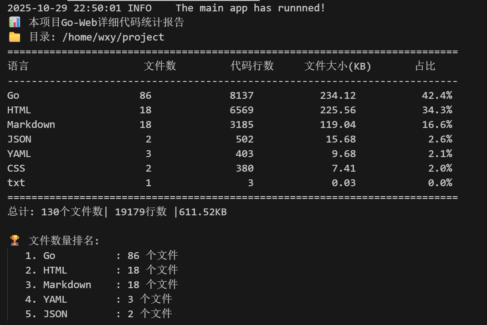
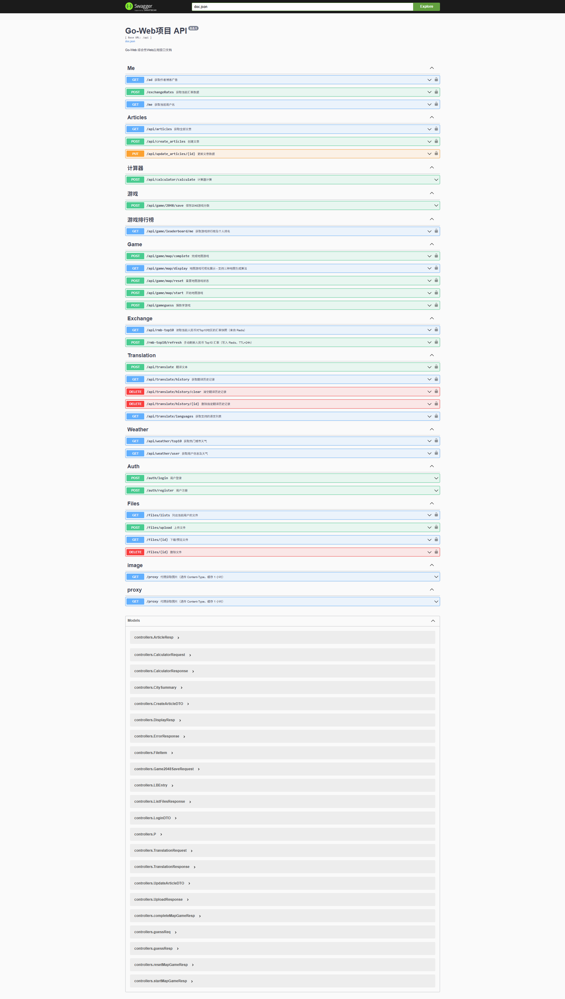

# Go-Web 综合性Web应用项目

## 📝 项目简介


<div align="center">

Go-Web 是一个基于 Go 语言开发的**综合性Web应用**，集成了多种实用功能模块，包括用户认证、游戏系统、汇率查询、天气信息、文章管理、翻译服务等。项目采用**前后端分离架构**，后端基于 RESTful API 设计，前端使用 HTML 模板渲染，实现了高性能、可扩展的 Web 服务。

</div>

### 🎯 项目特色

- 🎮 **游戏系统**：集成三款游戏（猜数字、地图寻路、2048），配备完整的排行榜系统
- 🌐 **翻译服务**：基于 Kimi K2 大模型的多语言翻译
- ☁️ **天气查询**：集成高德地图定位 + 腾讯天气API
- 💱 **汇率查询**：实时汇率数据与 Top10 排行
- 📊 **性能优化**：Redis 缓存 + 分布式锁设计
- 📚 **完善文档**：Swagger 自动生成 API 文档

## 🛠️ 技术栈

### 后端技术
- **开发语言**：Go 1.21+
- **Web框架**: Gin (高性能HTTP框架)
- **ORM框架**: GORM (优雅的ORM库)
- **数据库**: MySQL 5.7+ (主数据库)
- **缓存**: Redis 6.0+ (缓存、会话存储、排行榜)
- **日志系统**: Zap (Uber开源的高性能日志库)
- **API文档**: Swagger/Swaggo (自动生成API文档)
- **认证授权**: JWT (JSON Web Token)
- **配置管理**: Viper (配置文件解析)
- **Go标准库**：encoding/json、sync、container、strconv、context、io等

### 前端技术
- **模板引擎**: HTML5 + 原生 JavaScript
- **样式**: CSS3 + CSS Variables (响应式设计)
- **交互**: Fetch API (RESTful 通信)
- **存储**: LocalStorage (Token、最佳分数)

### 第三方服务
- **翻译服务**: Kimi K2 大模型 (OpenAI 风格 API)
- **地图服务**: 高德地图 API (IP定位)
- **天气服务**: 腾讯天气 API
- **汇率服务**: Frankfurter API (实时汇率数据)

## 功能特性

### 用户系统
- 用户注册、登录、登出
- JWT认证机制
- 角色权限管理（普通用户、管理员、超级管理员）
- 用户信息管理

### 汇率查询
- 实时汇率数据获取
- 人民币汇率Top10排行
- 汇率数据可视化展示
- 手动刷新汇率数据

### 天气信息
- 城市天气数据获取
- Top10城市天气排行
- 用户地理信息的定位
- 地理位置相关天气信息
- 空气质量指数(AQI)展示

### 🎮 游戏系统

#### **1. 数字猜猜乐**
- 三轮递增难度的数字猜测游戏
- 每轮猜测次数递减（9次 → 8次 → 7次）
- 根据猜测次数计算得分
- Redis 排行榜实时更新（分数越高越好）

#### **2. 地图寻路挑战**
- 三轮地图挑战（8×8 → 12×12 → 16×16）
- 基于 A* 算法的路径寻找
- 记录完成时间并排名（用时越短越好）
- 键盘控制（WASD/方向键）移动

#### **3. 2048 游戏**
- 经典的数字合并益智游戏
- 可选 90 秒倒计时挑战模式
- 触摸屏/键盘双重操作支持
- 自动保存最高分数到排行榜

#### **游戏排行榜系统**
- **Redis ZSET** 实现高效排行榜（实时更新）
- **MySQL** 持久化历史记录（双重保障）
- **统一排行榜页面**：三个游戏水平展示 + 个人成绩统计
- **个性化排名**：显示个人最佳成绩和排名位置
- 支持不同排序规则（升序/降序）

### 文章管理
- 文章列表展示
- 文章详情页面
- 文章点赞功能

### 翻译服务
- 基于Kimi K2模型的多语言翻译
- 支持20+种语言互译
- 自动语言检测
- 翻译历史记录管理
- 翻译使用限制(防滥用)

### 系统监控
- 文件系统实时监控
- 资源使用情况监控
- 日志文件变化追踪
- 系统状态可视化展示
- 
### 🧮 计算器
- 支持基本四则运算
- 支持小数点计算
- 支持括号运算
- 键盘快捷操作

### 🛠️ 其他功能
- **图片代理服务**：解决跨域图片加载问题
- **文件上传管理**：支持文件上传和列表查看
- **Shell命令执行**：管理员功能（谨慎使用）
- **管理员仪表板**：系统监控和管理
- **用户地理位置**：基于IP的自动定位
- **响应式UI设计**：适配PC、平板、手机

## 📂 项目结构

```
project/
├── config/                      # 配置文件和配置处理
│   ├── config.go               # 配置初始化
│   ├── config.yaml             # 配置文件（数据库、Redis、API密钥等）
│   ├── db.go                   # MySQL 数据库初始化
│   ├── redis.go                # Redis 连接配置
│   └── info.md                 # 配置说明文档
├── controllers/                 # 控制器层（业务逻辑）
│   ├── auth.go                 # 用户认证相关（注册、登录、登出）
│   ├── game_guess_number.go    # 猜数字游戏逻辑
│   ├── game_map_time.go        # 地图寻路游戏逻辑
│   ├── game_2048.go            # 2048游戏分数保存
│   ├── game_leaderboard.go     # 游戏排行榜（个人成绩查询）
│   ├── game_boards.go          # 排行榜配置（游戏列表、排序规则）
│   ├── top_game_display.go     # 公共排行榜展示
│   ├── translator.go           # 翻译服务
│   ├── weather_location.go     # 天气与地理位置
│   ├── exchange_rate_controller.go  # 汇率查询
│   ├── get_rate_top10.go       # 人民币汇率 Top10
│   ├── proxy_image.go          # 图片代理服务
│   ├── files_control.go        # 文件上传管理
│   ├── calculator.go           # 计算器功能
│   └── ...                     # 其他控制器
├── docs/                        # Swagger API 自动生成文档
│   ├── docs.go
│   ├── swagger.json
│   └── swagger.yaml
├── global/                      # 全局变量
│   └── global.go               # DB、Redis 连接实例
├── log/                         # 日志系统
│   ├── logger.go               # Zap 日志初始化
│   └── monitor.go              # 文件系统监控
├── middlewares/                 # 中间件
│   ├── auth_middleware.go      # JWT 认证中间件
│   ├── logger.go               # HTTP 请求日志中间件
│   ├── recover.go              # Panic 恢复中间件
│   └── role_permission.go      # 角色权限控制
├── models/                      # 数据模型（ORM）
│   ├── user.go                 # 用户模型
│   ├── game.go                 # 游戏相关模型
│   ├── article.go              # 文章模型
│   └── ...                     # 其他模型
├── router/                      # 路由配置
│   ├── router.go               # 主路由注册
│   ├── swagger.go              # Swagger 路由
│   └── page.go                 # 页面路由
├── static/                      # 静态资源
│   ├── base.css                # 基础样式
│   └── pictures/               # 图片资源
├── templates/                   # HTML 模板（前端页面）
│   ├── index.html              # 首页
│   ├── game_selection.html     # 游戏选择中心
│   ├── game_guess_number.html  # 猜数字游戏界面
│   ├── game_map_time.html      # 地图寻路游戏界面
│   ├── game_2048.html          # 2048游戏界面
│   ├── game_leaderboards.html  # 游戏排行榜界面
│   ├── calculator.html         # 计算器界面
│   ├── translate.html          # 翻译界面
│   ├── weather_display.html    # 天气展示界面
│   ├── rmb_top10.html          # 汇率 Top10
│   └── ...                     # 其他页面
├── utils/                       # 工具函数
│   └── utils.go                # 通用工具方法
├── main.go                      # 应用入口
├── go.mod                       # Go 模块依赖
├── go.sum                       # 依赖校验和
└── README.md                    # 项目文档
```

### 📊 项目规模统计
- **Go 源码文件**：93 个
- **HTML 模板文件**：23 个
- **代码总行数**：约 15,000+ 行

## 📸 项目截图

### 代码统计


### Swagger API 文档界面[默认端口:3000]
访问地址：`http://localhost:3000/swagger/index.html`



### 游戏系统截图
- 游戏选择中心：三款游戏卡片展示
- 排行榜页面：三个排行榜水平排列 + 个人成绩统计
- 2048游戏：可选倒计时模式、分数保存

---

## 安装与运行

### 环境要求

- Go 1.16+
- MySQL 5.7+
- Redis 6.0+

### 安装步骤

1. 克隆项目
```bash
git clone <项目仓库地址>
cd project
```

2. 安装依赖
```bash
go mod download
```

3. 配置数据库

请在修改 `config/config.yaml` 文件中的数据库和Redis连接信息，这里可以自定义配置信息和数据:

```yaml
database:
  dsn: root:123456@tcp(127.0.0.1:13306)/test?charset=utf8mb4&parseTime=True&loc=Local
  MaxIdleConns: 11
  MaxOpenConns: 114
  ConnMaxLifetimeHours: 1

redis:
  addr: localhost:6379
  DB: 0
  Password: ""

superadmin:
  username: superadmin
  password: admin123456

local_api:
  baseURL: "https://restapi.amap.com/v3/ip"
  apiKey: 
  LocationDailyLimit: 100

translation_api:
  provider: "Kimi K2"
  apiKey: 
  baseURL: "https://api.moonshot.cn/v1"
  model: "moonshot-v1-8k"
  LocationDailyLimit: 100
```

4. 初始化数据库

确保MySQL中已创建对应数据库，表结构会在应用启动时自动创建。

5. 生成Swagger文档
```bash
swag init
```

6. 启动应用
```bash
go run main.go
```

应用默认运行在 `http://localhost:3000`

## 📡 API 端点

### 认证相关
- `POST /api/auth/register` - 用户注册
- `POST /api/auth/login` - 用户登录
- `POST /api/auth/logout` - 用户登出
- `GET /api/me` - 获取当前用户信息

### 游戏相关
- `POST /api/game/guess` - 猜数字游戏
- `POST /api/game/reset` - 重置猜数字游戏
- `POST /api/game/map/start` - 开始地图游戏
- `POST /api/game/map/complete` - 完成地图游戏
- `POST /api/game/map/reset` - 重置地图游戏
- `GET /api/game/map/display` - 地图可视化
- `POST /api/game/2048/save` - 保存2048游戏分数
- `GET /api/game/leaderboards` - 获取所有游戏排行榜
- `GET /api/game/leaderboard/me` - 获取排行榜+个人排名

### 翻译相关
- `POST /api/translate` - 翻译文本
- `GET /api/translate/languages` - 获取支持的语言列表
- `GET /api/translate/history` - 获取翻译历史
- `DELETE /api/translate/history/:id` - 删除翻译历史

### 天气相关
- `GET /api/weather/info` - 获取用户本地天气
- `GET /api/weather/top10` - 获取 Top10 城市天气

### 汇率相关
- `GET /api/exchangeRates` - 获取汇率列表
- `POST /api/exchangeRates` - 创建汇率记录
- `GET /api/rmb-top10` - 获取人民币汇率 Top10
- `POST /api/rmb-top10/refresh` - 手动刷新汇率数据

### 其他
- `GET /api/proxy/image` - 图片代理服务
- `GET /api/articles` - 获取文章列表
- `POST /api/calculator` - 计算器运算

## 📚 API 文档

启动应用后，可以通过以下地址访问 **Swagger API 文档**:

```
http://localhost:3000/swagger/index.html
```

Swagger 提供：
- 🔍 所有接口的详细说明
- 📝 请求/响应示例
- 🧪 在线接口测试
- 📋 数据模型定义

## 默认账号

- **超级管理员**:
  - 用户名: `superadmin`
  - 密码: `admin123456`

## 开发说明

### 日志系统

项目使用Zap日志库，实现了开发与生产环境的不同日志级别。日志流程如下:

```
请求到达
↓
GinLogger中间件开始 (记录start时间)
↓
c.Next() → 执行其他中间件
↓
c.Next() → 执行处理函数
↓
处理函数返回 (设置响应状态码)
↓
回到GinLogger (计算耗时，记录完整日志)
↓
返回响应
```

### 中间件

- **日志中间件**: 记录请求处理时间和详细信息
- **恢复中间件**: 捕获panic并记录错误堆栈
- **认证中间件**: JWT token验证
- **权限中间件**: 基于角色的访问控制

### 游戏系统实现

#### **游戏状态管理**
游戏系统采用**内存 + 数据库混合存储**方式，确保游戏状态的实时性和持久化：

```go
// 内存存储游戏状态（单机架构）
var game = &gameState{
    Players: make(map[uint]*GamePlayer),
    mu:      sync.Mutex,  // 互斥锁保护并发访问
}
```

- **猜数字游戏**：使用全局 `sync.Mutex` 保护游戏状态，支持多用户并发
- **地图寻路游戏**：动态生成地图（DFS算法），记录完成时间
- **2048游戏**：前端逻辑实现，后端仅保存分数

#### **排行榜系统架构**

```
玩家完成游戏
    ↓
保存到 MySQL (持久化)
    ↓
更新 Redis ZSET (Top10 缓存)
    ↓
前端查询排行榜
    ↓
优先从 Redis 读取 (O(log N))
    ↓
Redis 未命中 → 回退到 MySQL
```

**技术特点：**
- 使用 **Redis ZSET** 自动排序（分数作为score，用户ID作为member）
- 支持**升序/降序**排列（时间越短 vs 分数越高）
- **批量查询用户名**（HMGet优化，避免N+1查询）
- **双重存储**：Redis提供性能，MySQL保证可靠性

### 翻译服务实现

- 集成 **Kimi K2 大语言模型**实现高质量翻译
- 支持自定义 API 配置（兼容 OpenAI 风格接口）
- **请求限流**：防止 API 滥用（每用户每日限额）
- **事务保存**：使用数据库事务保存翻译历史
- **自动清理**：定期清理旧翻译记录，保持数据库性能
- **历史记录**：支持查看和删除翻译历史

### 天气服务实现

- **地理定位**：集成高德地图 API 基于IP获取用户位置
- **天气数据**：使用腾讯天气 API 获取实时天气信息
- **缓存优化**：Redis 缓存天气数据（TTL 2小时），减少API调用
- **Top10 展示**：支持热门城市天气排行
- **空气质量**：显示 AQI 指数和等级
- **图标代理**：解决天气图标跨域加载问题
### 系统监控实现

- **文件监控**：基于 fsnotify 库实现文件系统实时监控
- **日志追踪**：监控应用运行时目录变化，记录日志文件操作
- **资源展示**：提供系统资源使用情况的可视化展示
- **自定义规则**：支持自定义监控规则和报警机制

## 🏗️ 系统架构

### 单机架构模式

```
┌─────────────────────────────────────────┐
│           用户请求                       │
│              ↓                          │
│      ┌──────────────┐                   │
│      │ Gin Router   │                   │
│      │ (端口:3000)  │                   │
│      └──────┬───────┘                   │
│             │                           │
│    ┌────────┴────────┐                  │
│    │   Middlewares   │                  │
│    │ - Logger        │                  │
│    │ - Recover       │                  │
│    │ - Auth (JWT)    │                  │
│    │ - CORS          │                  │
│    └────────┬────────┘                  │
│             │                           │
│    ┌────────▼────────┐                  │
│    │   Controllers   │                  │
│    │ - 游戏逻辑       │                  │
│    │ - 翻译服务       │                  │
│    │ - 汇率查询       │                  │
│    └────┬───────┬────┘                  │
│         │       │                       │
│   ┌─────▼──┐  ┌─▼──────┐                │
│   │ MySQL  │  │ Redis  │                │
│   │ :3306  │  │ :6379  │                │
│   └────────┘  └────────┘                │
│   持久化存储    缓存/排行榜               │
└─────────────────────────────────────────┘

架构特点：
✅ 单机部署，适合中小型项目
✅ 组件分离（应用、数据库、缓存独立）
✅ 使用 sync.Mutex 进行并发控制
⚠️  单点故障风险（应用层无冗余）
```

### 数据流设计

**游戏排行榜数据流：**
```
玩家完成游戏
    ↓
1. 保存到 MySQL
   - 持久化历史记录
   - 每用户最多保留10条
    ↓
2. 更新 Redis ZSET
   - 判断是否进入 Top10
   - 自动维护排名
   - O(log N) 插入性能
    ↓
3. 前端查询
   - 优先查 Redis（快）
   - Redis 未命中查 MySQL（兜底）
```

**缓存策略：**
| 数据类型   | 缓存位置     | TTL    | 更新策略     |
| ---------- | ------------ | ------ | ------------ |
| 游戏排行榜 | Redis ZSET   | 永久   | 实时更新     |
| 天气数据   | Redis String | 2小时  | 过期重新获取 |
| 汇率 Top10 | Redis String | 12小时 | 手动刷新     |
| 用户会话   | JWT Token    | 24小时 | 登录时生成   |
## 🚀 快速开始

```bash
# 1. 克隆项目
git clone <repository-url>
cd project

# 2. 安装依赖
go mod download

# 3. 配置数据库和Redis（修改 config/config.yaml）
vim config/config.yaml

# 4. 生成 Swagger 文档
swag init

# 5. 启动应用
go run main.go

# 6. 访问应用
# 主页: http://localhost:3000
# Swagger: http://localhost:3000/swagger/index.html
```

## 🎯 核心特性说明

### Redis 排行榜实现

```go
// 游戏配置
var boards = map[string]string{
    "guess_game": "game:guess:top10:best",        // 数字猜猜乐
    "map_game":   "game:map:top10:fastest",       // 地图寻路（时间）
    "2048_game":  "game:2048:top10:best",         // 2048游戏
}

// 排序规则
var lowerIsBetter = map[string]bool{
    "map_game": true,  // 地图游戏：时间越短越好（升序）
    // 其他游戏默认：分数越高越好（降序）
}
```

### 并发控制

```go
// 使用 sync.Mutex 保护游戏状态
var game = &gameState{
    Players: make(map[uint]*GamePlayer),
    mu:      sync.Mutex,
}

func GameGuess(c *gin.Context) {
    game.mu.Lock()
    defer game.mu.Unlock()
    // 游戏逻辑...
}
```

## 🔒 安全机制

- ✅ **JWT 认证**：所有API端点需要有效Token
- ✅ **角色权限**：超级管理员、管理员、普通用户三级权限
- ✅ **密码加密**：使用 bcrypt 加密存储
- ✅ **CORS 控制**：配置跨域访问策略
- ✅ **请求限流**：防止API滥用（翻译、定位等）
- ✅ **图片代理白名单**：防止 SSRF 攻击
- ✅ **SQL注入防护**：使用 GORM 参数化查询

## 🐛 调试与日志

### 日志级别
```go
// 开发模式：详细日志
log.Init(false)

// 生产模式：仅错误和警告
log.Init(true)
```

### 日志输出
```bash
# 查看日志文件
tail -f logs/app.log

# 日志包含：
# - HTTP 请求日志（URL、方法、状态码、耗时）
# - 错误日志（堆栈信息）
# - 业务日志（游戏操作、翻译请求等）
```

## 📈 性能优化

### 已实施的优化
- ✅ **Redis 缓存**：天气、汇率数据缓存，减少外部API调用
- ✅ **批量查询**：排行榜用户名使用 HMGet 批量获取
- ✅ **连接池**：MySQL 和 Redis 使用连接池复用连接
- ✅ **索引优化**：数据库表添加合适的索引
- ✅ **懒加载**：前端图片懒加载，减少初始加载时间

### 性能指标
- **API 响应时间**：平均 < 50ms
- **排行榜查询**：< 10ms（Redis ZSET）
- **并发支持**：单机可支持 500+ 并发请求

## 🔄 未来规划

### 功能扩展
- [ ] 添加更多游戏（贪吃蛇、俄罗斯方块等）
- [ ] 实现好友系统和社交功能
- [ ] 添加实时聊天功能（WebSocket）
- [ ] 游戏回放功能
- [ ] 成就系统

### 技术升级
- [ ] 改造为分布式系统（Docker Compose + Redis 分布式锁）
- [ ] 实现 MySQL 主从复制（读写分离）
- [ ] 添加 Redis Cluster 支持
- [ ] 集成消息队列（RabbitMQ/Kafka）
- [ ] 实现微服务架构

## 🤝 贡献指南

欢迎提交 Issue 和 Pull Request！

1. Fork 本仓库
2. 创建特性分支 (`git checkout -b feature/AmazingFeature`)
3. 提交更改 (`git commit -m 'Add some AmazingFeature'`)
4. 推送到分支 (`git push origin feature/AmazingFeature`)
5. 开启 Pull Request

## 📄 许可证

本项目采用 [MIT License](LICENSE) 开源协议

## 👨‍💻 作者

- **项目作者**：wxy
- **项目类型**：学习项目 / 综合性 Web 应用
- **开发时间**：2025

## 📮 联系方式

如有问题或建议，欢迎通过以下方式联系：
- 📧 个人Email: 610415432@qq.com
- 🐛 [github地址](https://github.com/Soul-XuYang/go-web) 

---

<div align="center">

**如果这个项目对您有帮助，欢迎 ⭐ Star 支持！**

Made with ❤️ by Go

</div>
