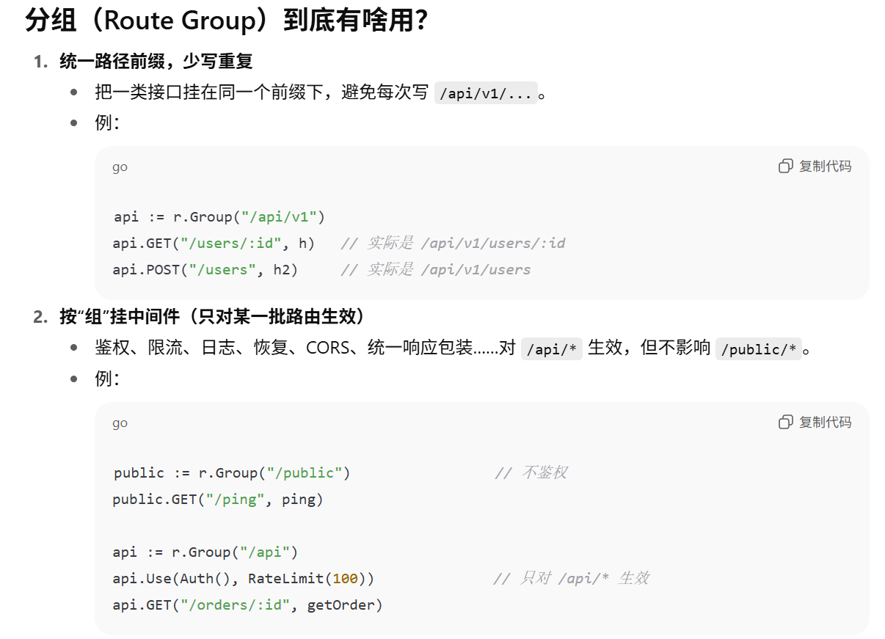
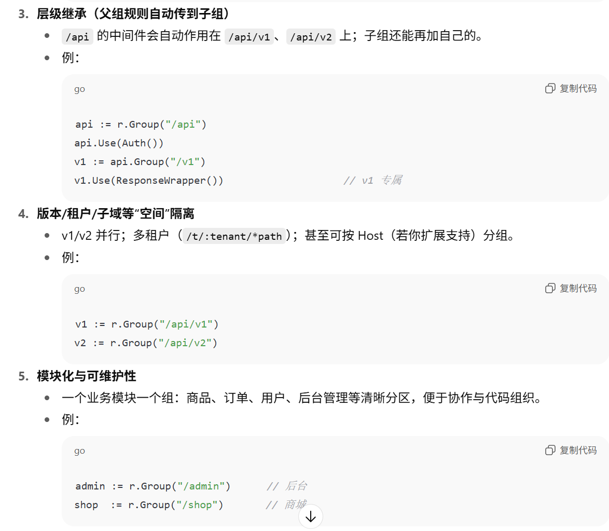
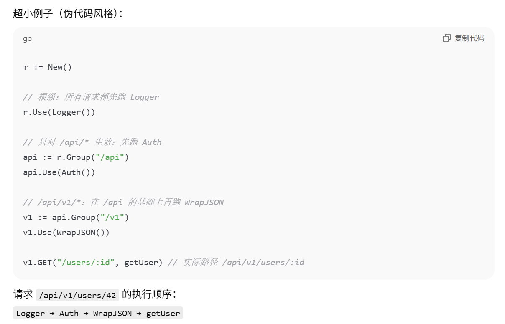

## Day04
### 分组
这里引入分组的概念:
概念：给一批路由统一加上路径前缀与中间件的容器。
效果：写路由时自动拼上前缀；请求时，这个组（含父组）的中间件会按顺序套用。
分组（Route Group）最直观的作用就是给一批路由统一加路径前缀，从而把不同功能区分开来（比如 /api、/admin、/api/v1）
能做什么（常见用法）：
- 模块化前缀：/api、/api/v1、/admin…
- 按组加中间件：鉴权、限流、日志、Tracing、事务、CSRF 等只针对某一大类接口。
- 版本/租户隔离：/api/v1、/api/v2；/t/:tenant/*path。
- 挂载子应用：把某个子模块整体接到 /shop、/blog 下。
- 统一资源控制：静态文件、上传下载、网关式前缀。
**最重要的是按组挂中间件（Middleware Stacking）**
分组控制(Group Control)是 Web 框架应提供的基础功能之一。所谓分组，是指路由的分组。如果没有路由分组，我们需要针对每一个路由进行控制。但是真实的业务场景中，往往某一组路由需要相似的处理。例如：
以/post开头的路由匿名可访问。
以/admin开头的路由需要鉴权。
以/api开头的路由是 RESTful 接口，可以对接第三方平台，需要三方平台鉴权。
```go
func (group *RouterGroup) Group(prefix string) *RouterGroup {
	engine := group.engine
	newGroup := &RouterGroup{  // 在此条件下嵌套创建新的 RouterGroup
		prefix: group.prefix + prefix,  // 父组前缀+本次传入的前缀
		parent: group,  // 上述的父组
		engine: engine,
	}
	engine.groups = append(engine.groups, newGroup)
	return newGroup
}
```
上述代码中的嵌套分组:
- 同一引擎（engine 一致）
RouterGroup 里有 engine *Engine；Group() 创建子组时把 engine: group.engine 传下去。
因此所有分组共享同一个 Engine 实例，注册路由时都会走同一个 engine.router.addRoute(...)，路由树是统一的。
- 可嵌套（父子链 + 前缀叠加）,子组把 parent: group 保存起来形成父子链；
- 同时在创建时一次性把前缀叠加：prefix: group.prefix + prefix。于是形成层级："" -> "/v1" -> "/v1/users" -> ...；后续 addRoute 再把组前缀 + 局部路由拼成完整路径注册。
```swift
Engine
 ├─ router  (全局唯一路由树)
 ├─ groups: [root, v1, v1/users, admin, ...]
 └─ *RouterGroup  (root 组，匿名内嵌，便于 r.Group(...))

RouterGroup (root)
 ├─ prefix = ""
 ├─ engine ────────────────┐  （所有子组共用同一个 Engine）
 └─ Group("/v1") -> RouterGroup{ prefix="/v1", parent=root, engine=Engine }
                              └─ Group("/users") -> RouterGroup{ prefix="/v1/users", parent=v1, engine=Engine }
```

大部分情况下的路由分组，是以相同的前缀来区分的。因此，我们今天实现的分组控制也是以前缀来区分，并且支持分组的嵌套。例如/post是一个分组，/post/a和/post/b可以是该分组下的子分组。作用在/post分组上的中间件(middleware)，也都会作用在子分组，子分组还可以应用自己特有的中间件。
中间件可以给框架提供无限的扩展能力，应用在分组上，可以使得分组控制的收益更为明显，而不是共享相同的路由前缀这么简单。例如/admin的分组，可以应用鉴权中间件；/分组应用日志中间件，/是默认的最顶层的分组，也就意味着给所有的路由，即整个框架增加了记录日志的能力。


本质的用法:
- 中间件是功能，分组前缀是选择这些功能要不要套用。
- 组的嵌套让中间件层层叠加（像继承的效果），但本质是组合

### 分组的妙用-后续的中间件(Day05)
在 Gee 的设计里，r.Group("/v1") 不只是“给路由加前缀”，还承担了层级组织与**（将来 Day05）中间件继承/治理的挂载点**。再往工程化拓展，它通常还作为版本/域的边界和统一配置的作用域。
新增 RouterGroup{ prefix, parent, engine }（有的示例也先预留 middlewares 字段，但不使用）。
在 Engine：
匿名内嵌一个“根组” *RouterGroup，便于 r.Group(...)。
维护 groups []*RouterGroup（为 Day05 做准备）。
提供分组相关方法：
Group(prefix string) *RouterGroup：叠加前缀（父前缀 + 新前缀）。
(*RouterGroup).GET/POST(...)：调用 addRoute，把组前缀 + 路由片段拼成完整路径注册。
ServeHTTP 在 Day04 仍是：newContext → engine.router.handle(c)，不做中间件收集/执行。
**实际的操作**
- 注册期：Group 叠前缀 → addRoute("GET", group.prefix + comp, handler) → 放进 Trie
- 运行期：ServeHTTP 直接交给 router.handle 做匹配与调用
### 细节
**注**:
RouterGroup.engine *Engine（组 → 引擎）
组在注册路由/加分组时，需要“回到引擎”：

- 把“前缀 + 相对路径”的完整路由注册到统一路由器：g.engine.router.addRoute(...)

- 把自己登记到引擎的分组列表里：g.engine.groups = append(...)，这样请求来时引擎能“按前缀收集中间件”

Engine.groups []*RouterGroup + 内嵌 *RouterGroup（引擎 → 组）
- 引擎处理请求（ServeHTTP）时，需要：
遍历所有 groups，凡是前缀命中的就把中间件叠进执行链
- 然后交给路由器匹配最终 handler，组合成“中间件链 → 业务 handler”一起执行
内嵌根组让你可以直接 r.Use(...)、r.Group("/api")（方法提升，API 顺手）

一句话：组需要引擎来“注册”，引擎需要所有组来“调度”。互指让这两件事都自然发生。
实质上是
组 → 引擎（登记分组）：g.engine.groups = append(...)
组 → 引擎（→ 路由器，注册路由）：g.engine.router.addRoute(...)
这两处就是“组调用引擎”的具体代码位置；有了它们，声明期（写路由/分组）能把信息集中到引擎里，运行期（收集中间件/匹配路由）引擎才能一把梳理、统一调度。

-----
- 同一引擎（engine 一致）
RouterGroup 里有 engine *Engine；
Group() 创建子组时把 engine: group.engine 传下去。
因此所有分组共享同一个 **Engine** 实例，注册路由时都会走同一个 engine.router.addRoute(...)，路由树是统一的。
- 可嵌套（父子链 + 前缀叠加），子组把 parent: group 保存起来形成父子链；
同时在创建时一次性把前缀叠加：prefix: group.prefix + prefix。
于是形成层级："" -> "/v1" -> "/v1/users" -> ...；后续 addRoute 再把组前缀 + 局部路由拼成完整路径注册。

- 路径前缀：已在子组创建时叠加完成；不需运行期回溯父链。
中间件继承（你已为此预留了 middlewares []HandlerFunc）：
继承不是在 Group() 里做，而是请求到来时或注册时合并。常见做法（Day05 会实现）是在 ServeHTTP 里：

- 遍历 engine.groups，找出所有 req.URL.Path 以该 group.prefix 开头的分组；
按前缀长度从短到长拼接中间件链，实现“父组中间件先于子组中间件执行”。
也可在注册路由时把“已继承的中间件切片”记录进路由表，这样匹配到路由就拿到最终链。