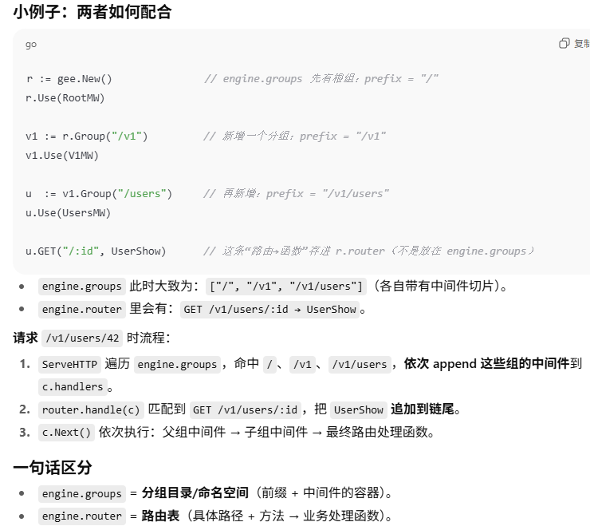

## Day05

### 挂载中间件
```go
func (group *RouterGroup) Use(middlewares ...HandlerFunc) {  //给分组（RouterGroup）“挂载中间件”
	group.middlewares = append(group.middlewares, middlewares...)  // 你调用 v1.Use(Auth(), RateLimit()) 时，这个函数把传入的**中间件函数**追加到该分组的 middlewares 切片里，仅做“登记”，不在此处执行
}
```
- 把一串 HandlerFunc（中间件）存到 group.middlewares。
- 这些中间件应当在“请求到来时”对该组前缀及其子组/路由生效（例如 /v1/*）
- ... 是 可变参数（variadic parameter） 的语法，表示可以传入 0 个、1 个或多个 HandlerFunc
### 中间件的收集
```go
func (engine *Engine) ServeHTTP(w http.ResponseWriter, req *http.Request) {
    c := newContext(w, req) // c.handlers 为空，c.index = -1
    p := req.URL.Path

    // 推荐“严格前缀”判定，避免 /v1 误命中 /v10
    for _, g := range engine.groups {
        pref := g.prefix
        if p == pref || strings.HasPrefix(p, pref + "/") || pref == "/" {
            c.handlers = append(c.handlers, g.middlewares...)
        }
    }
    engine.router.handle(c) // 这里再把最终路由 handler 追加进去并 c.Next()
}

```
例如，逐步模拟一次请求：GET /v1/users/42
我们跟踪 c.handlers 的变化：
初始：c.handlers = []
遇到组 /：命中 →
c.handlers = [RootMW]
遇到组 /v1：命中 →
c.handlers = [RootMW, V1MW]
遇到组 /v1/users：命中 →
c.handlers = [RootMW, V1MW, UsersMW]
遇到组 /admin：不命中 → 跳过
进入 router.handle(c) 后：
匹配到路由 /v1/users/:id，取得最终处理函数 UserShow
继续拼接：
c.handlers = [RootMW, V1MW, UsersMW, UserShow]
设 c.index = -1，调用 c.Next() 依次执行整条链
执行顺序最终就是：RootMW → V1MW → UsersMW → UserShow（若某中间件 Abort/Fail()，则终止后续）。

实际的拼接轨迹如下，本质上每一个前缀都代表着对应的函数(与路由组相关联)：
```swift
"/"            → [RootMW]
"/v1"          → [V1MW]
"/v1/users"    → [UsersMW]
"/admin"       → [AdminMW]
"/v1/users/:id" → [UserShow]
```
### Context和中间件的执行逻辑
// 依次执行 handlers 列表中的函数(这里上述已经都收集过了)
```go
func (c *Context) Next() {
	c.index++  // 这里对应-1
	func_length := len(c.handlers)
	for ; c.index < func_length; c.index++ {
		c.handlers[c.index](c)  // 执行对应的函数
	}
}

func (c *Context) Abort() { c.index = len(c.handlers) }
func (c *Context) Fail(code int, err string) {
	c.index = len(c.handlers)  //末尾信息设置，终止当前的执行链，让NEXT函数不再执行
	c.JSON(code, H{"message": err})
}
```
Next函数
Next():
  index=-1 → 0 执行 A → A 调 c.Next() 进入 B
                 → B 调 c.Fail() 把 index 设为 len(handlers)=3，并写响应
                 ← 返回到 A 的 c.Next() 循环，此时 index=3，不再 < 3 → 退出循环
结束：C（Final）不会被执行

路径使用:
```go
func (engine *Engine) ServeHTTP(w http.ResponseWriter, req *http.Request) {
	var middlewares []HandlerFunc  // middlewares 切片，用于存储中间件函数
	for _, group := range engine.groups {  // 遍历所有的路由分组-查询其请求的URL路径是否有对应的分组名称
		if strings.HasPrefix(req.URL.Path, group.prefix) {
			middlewares = append(middlewares, group.middlewares...)
		}
	}
	c := newContext(w, req)  // 创建Context上下文
	c.handlers = middlewares
	engine.router.handle(c)
}
```
这句 if strings.HasPrefix(req.URL.Path, group.prefix) 的意思是：
判断当前请求的路径是否“以该分组的前缀开头”。若是，就把这个分组上登记的中间件 group.middlewares 追加进本次请求的中间件链（middlewares = append(...)），这样这些中间件就会对该请求生效。这么做可以让父组的中间件自动对子路径（子组与其下所有路由）生效：例如分组前缀为 /v1，则 /v1/ping、/v1/users/42 都会命中。

**难点**:
append这一操作，因为之前注册路由不是已经添加过了，这次我们举个例子比如GET /v1/users/:id有前缀 / ，/v1以及/v1/users这三个group，我们会将其对应的函数一次次添加进去，直到完毕就停止添加了,从父组到子组都会添加的:

1. 初始：middlewares = []
2. 遍历到组 /：HasPrefix("/v1/users/42", "/") 命中
→ middlewares = [RootMW...]
3. 遍历到组 /v1：命中
→ middlewares = [RootMW..., V1MW...]
4. 遍历到组 /v1/users：命中
→ middlewares = [RootMW..., V1MW..., UsersMW...]
5. 遍历到组 /admin：不命中
→ 不变

循环结束：
c.handlers = [RootMW..., V1MW..., UsersMW...]（这里只是中间
### 中间件执行顺序
流程总结：
ServeHTTP 收集中间件 → router.handle 把最终 handler 也塞进 c.handlers → 调用 c.Next() → 依次执行：父组中间件 → 子组中间件 → 最终路由 handler。
**注**:中间件内部若想“放行到后面”，会调用 c.Next()；若想中断，调用 c.Abort()/Fail()。

### 分组列表和路由器的区别

路由表” vs “分组列表”
路由表（engine.router）里存的是具体路由 → 最终业务处理函数的映射（按 method 分树/Trie），例如：GET /v1/users/:id → UserShow。
分组列表（engine.groups）里存的是一组前缀命名空间（prefix）及其中间件集合（[]HandlerFunc），例如：/v1 → [Logger, Auth]，/v1/users → [Audit]。

“每个组对应一个中间件”不完全对
更准确是：每个组拥有一个“中间件切片”（可以 0 个、1 个或多个）。收集时把所有命中的组的中间件切片按“父 → 子”顺序 append 到 c.handlers，再由路由器把最终业务 handler追加到链尾，最后一次性 c.Next() 执行整条链。

**总结**:所以：分组是“前缀 + 一组中间件”的容器；路由表是“路径 + 最终处理函数”的映射。两者在 ServeHTTP/router.handle 处完成拼接并执行