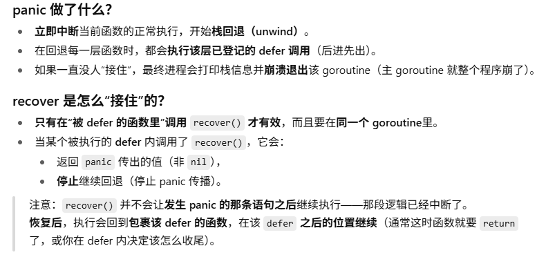
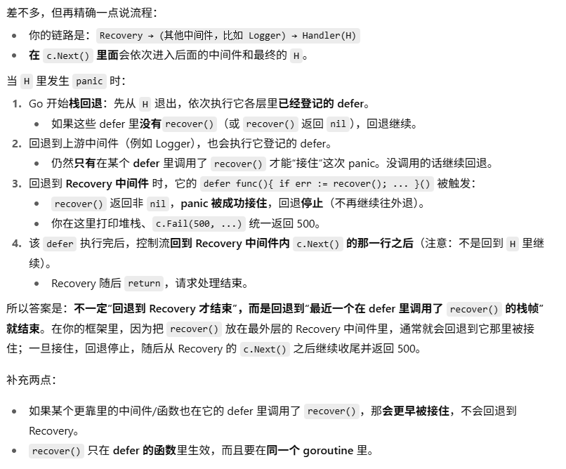
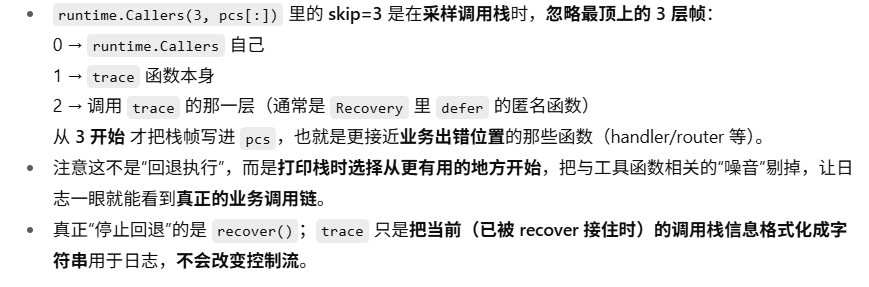
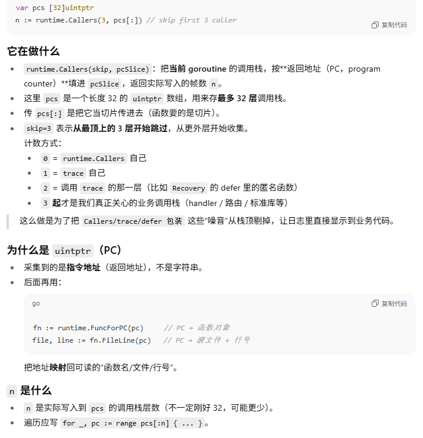
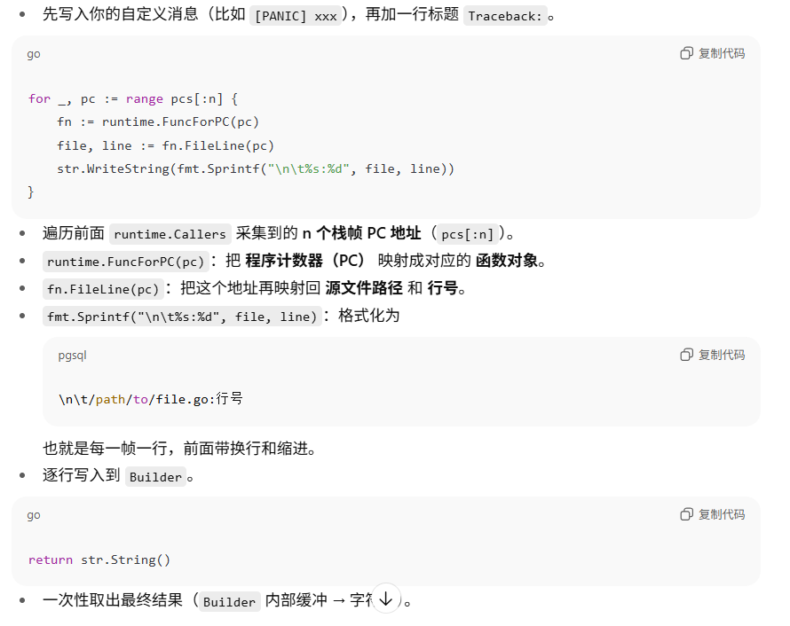
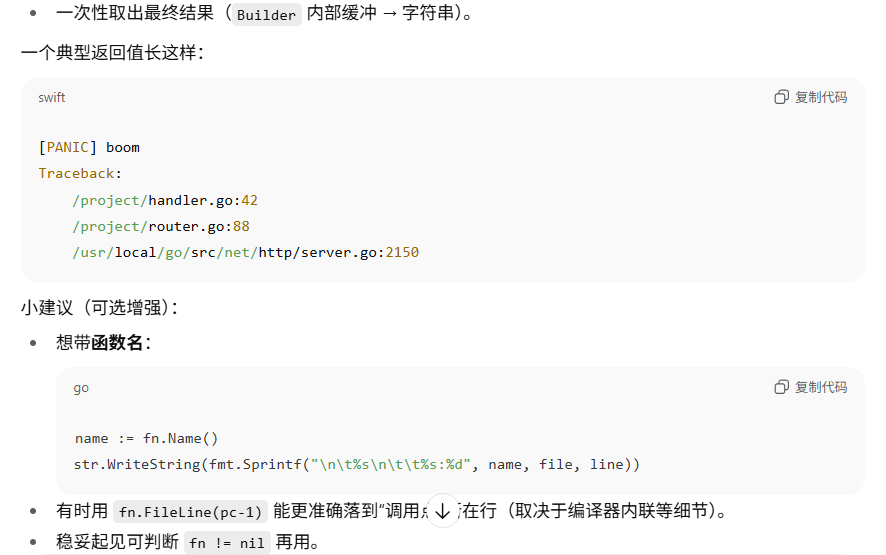

## Day07-异常错误处理机制
这里在gee中添加一个错误处理机制，即当此类错误发生时，系统不会直接**宕机**而是返回错误并继续运行
### Recovery组件
错误处理也可以作为一个中间件，增强 gee 框架的能力:
```go
func Recovery() HandlerFunc {
	return func(c *Context) {
        // 先调入栈里
		defer func() {
			if err := recover(); err != nil { // 检测到错误
				message := fmt.Sprintf("错误:%s", err)
				log.Printf("%s\n\n", trace(message))
				c.Fail(http.StatusInternalServerError, "Internal Server Error")  //返回code和列表的错误信息
			}
		}()

		c.Next()
	}
}
```
这里需要注意的就是这里是先提前写入有无错误的判断再next执行()
本质在于
- func 是函数值，后面的()才表示这一次函数调用。defer func(){ ... }() 的意思是：把这次调用登记到 **defer 栈**，等当前函数返回时再执行（无论是正常 return还是发生 panic导致的栈回退，都会执行）
- 不是“遇到错误才执行 defer”，而是一定会在返回/退出该函数时执行；发生 panic 时也会执行（这就是 recover() 能生效的原因——它必须写在一个被 defer 的函数里）

recover()函数的回退流程: 一般设计时只会在初始时登记defer

### 打印错误信息
```go
func trace(message string) string {  //message是我们自定义的信息
	var pcs [32]uintptr // 指令地址-32层
	n := runtime.Callers(3, pcs[:]) //  把当前 goroutine 的调用栈，按**返回地址（PC，program counter）**填进 pcSlice，返回实际写入的帧数 n

	var str strings.Builder
	str.WriteString(message + "\nTraceback:")
	for _, pc := range pcs[:n] {
		fn := runtime.FuncForPC(pc)
		file, line := fn.FileLine(pc)
		str.WriteString(fmt.Sprintf("\n\t%s:%d", file, line))
	}
	return str.String()
}
```
这里runtime.Callers(3, pcs[:])跳过当前已经使用过的函数，即回退到真正报错的函数里即业务框架里。(函数的使用是**堆栈**结构)-Callers(skip=3) 负责从更靠近事故现场的位置开始拍照（取证）。




后续字符串信息的打印:
```go
var str strings.Builder
str.WriteString(message + "\nTraceback:")
```
下述的索引也可以写成i-n的情况

```go
func trace(message string) string { //message是我们自定义的信息
	var pcs [32]uintptr             // 指令地址-32层
	n := runtime.Callers(3, pcs[:]) //  把当前 goroutine 的调用栈，按**返回地址（PC，program counter）**填进 pcSlice，返回实际写入的帧数 n

	var str strings.Builder
	str.WriteString(message + "\nTraceback:")
	for _, pc := range pcs[:n] { // range是切片范围遍历到n停止
		fn := runtime.FuncForPC(pc) // 映射成函数对象 - pc是程序计数器的地址，runtime.FuncForPC(pc) 会把这个地址映射成一个函数描述对象
		name := fn.Name()  //fn就是一个描述对象
		file, line := fn.FileLine(pc)                                                         //映射回源文件的路径和行号
		str.WriteString(fmt.Sprintf("filepath:%s|func_name:%s|line:%d\n ", file, name, line)) // 打印行号和列号
	}
	return str.String()
}
```
这里可以使用fn.Name取函数名字
