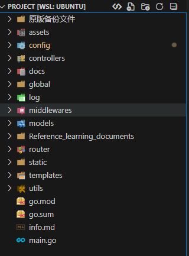

## 本项目框架的基本信息
### 项目分层重构
各个文件夹和代码对应的参数如下图



项目目录包含各种代码和配置数据
### 配置文件
config.yaml配置文件，config.go是处理配置文件的函数
程序运行的主要参数请在config.yaml上修改

### 日志系统和recover修复
这里使用zap日志,构建开发和生成模式
构建对应的中间件以及recover中间件

实际这里的日志操作流程:
```
请求到达
↓
GinLogger中间件开始 (记录start时间)
↓
c.Next() → 执行其他中间件
↓
c.Next() → 执行处理函数
↓
处理函数返回 (设置响应状态码)
↓
回到GinLogger (计算耗时，记录完整日志)
↓
返回响应
```
defer来堆栈进行recover的实现并设置panic错误后的信息
```go
func GinRecovery() gin.HandlerFunc {
	return func(c *gin.Context) {
		defer func() {
			if err := recover(); err != nil {
				L().Error("panic recovered",
					zap.Any("error", err),                  // 存入错误信息
					zap.ByteString("stack", debug.Stack()), // 记录堆栈信息
					zap.String("method", c.Request.Method), //对应的HTTP返回的方法
					zap.String("path", c.Request.URL.Path), //对应的HTTP返回的路径
				)
				c.AbortWithStatusJSON(500, gin.H{"error": "InternalServer error"}) // 返回 500（最简单版）
			}
		}()
		c.Next()
	}
}
```

### Swagger的配置和使用
```go
mountSwagger(r) 
```
就是把 Swagger UI 挂到路由上的一个小封装。
你前面用 swag init 生成了 docs/ 包，但如果不在 Gin 里注册 UI 路由，浏览器是看不到文档页面的.

以下是Swagger注解说明:
```
@Title	API 标题	@title User API
@Version	API 版本	@version 1.0
@Description	API 描述	@description 用户管理接口
@Param	请求参数	@Param id path int true "用户ID"
@Success	成功响应	@Success 200 {object} User
@Failure	错误响应	@Failure 400 {object} map[string]interface{}
@Router	路由定义	@Router /users [post]
@Tags	接口分组	@Tags users
```
