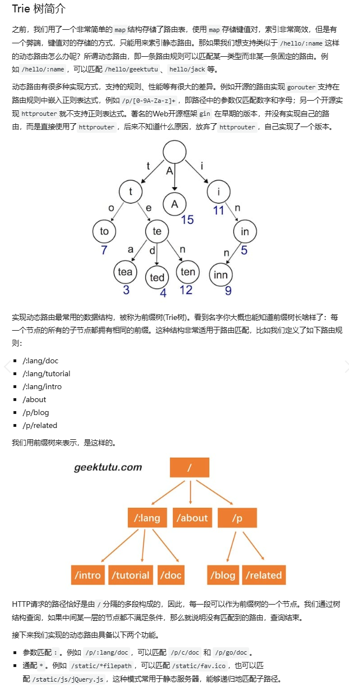

## Day03
实际上是对Day02的使用和编写的拓展
### 关键结构-Trie路由前缀树

```go
type node struct {  
	pattern  string    // 只有当一条路由在此节点“完整结束”时才会写入 - 用于判断“这里是不是一个可命中的终点
	part     string    // 当前节点代表的“路径片段”（按 / 切分后的某一段）。
	children []*node   // 子节点，存储下一级的节点
	isWild   bool      // 该片段是否为动态匹配（以 : 或 * 开头）
}
```
这里树的插入以及对应的查询都是用DFS递归来实现的
```go
// part表示当前的字符串，parts表示所有字符串，height表示当前树的深度
func (n *node) insert(pattern string, parts []string, height int) {
	if len(parts) == height {  //当走到 height == len(parts) 时，说明整条路由的所有片段都“落位”了；此时把完整路由模板写到 n.pattern，标记“此处为可命中的终点”（以后匹配到这里才算一条有效路由）。
		n.pattern = pattern
		return
	}
	part := parts[height]
	child := n.matchChild(part)  
	//取当前层要插入的片段 part := parts[height]，在子节点里找可复用的分支：
   // matchChild(part) 会优先复用同名静态段或已存在的动态段（isWild==true）；
   // 若没有，则新建子节点，并依据 part 首字符设置 isWild：
   // : 或 * → true（动态匹配）、 其他 → false（字面匹配）
	if child == nil {
		child = &node{part: part, isWild: part[0] == ':' || part[0] == '*'}  // 在这里，这套路由里动态片段就是用 : 和 * 来表示的前缀的
		n.children = append(n.children, child)
	}
	child.insert(pattern, parts, height+1)  //递归，深度+1
}
```
这里的part和pattern都是字符串，但是pattern是完整的路由，而part是当前层级的路由

```go
func (n *node) search(parts []string, height int) *node {
	if len(parts) == height || strings.HasPrefix(n.part, "*") {  //当走到 height == len(parts) 时，说明整条路由的所有片段都“落位”了；此时把完整路由模板写到 n.pattern，标记“此处为可命中的终点”（以后匹配到这里才算一条有效路由）。
    //要么二者的前缀都有* ，* 吞尾：无论后面还有多少片段，都允许在此“直接终止”
		if n.pattern == "" {  // 终止了，但是原先的pattern没有整个说明没有匹配到，返回nil
			return nil
		}
		return n  //找到了返回该节点
	}

	part := parts[height] // 取值
	children := n.matchChildren(part)  // 看是否存在匹配的子节点
	for _, child := range children {
		result := child.search(parts, height+1)
		if result != nil {
			return result
		}
	}

	return nil
}
```
#### 动态路由的细节:和*

小对比
/users/:id/profile
:id 只吃一段，还要继续匹配 profile，所以 必须建节点 并往下走。
/assets/*filepath
*filepath 吃到尾，后续不再匹配，不需要也不允许再建子节点；解析遇到 * 就 break，搜索遇到 * 就可终止。

### 路由表
#### 解析路由部分
```go
func parsePattern(pattern string) []string {
	vs := strings.Split(pattern, "/")  //将字符串按/分割
	parts := make([]string, 0)  // 字符串列表
	for _, item := range vs {
		if item != "" {
			parts = append(parts, item)
			if item[0] == '*' {
				break
			}
		}
	}
	return parts
}
```
解析路由模板或请求路径时（parsePattern），一旦遇到以 * 开头的片段（如 *filepath），就立即 break，不再继续读取后面的字符串。
也就是说，* 表示**“吞尾通配”：匹配从这里开始直到路径结束的所有剩余片段**
（可包含 /），并将其绑定到 * 后面的名字上（如 filepath）。

而单端路由则是::name —— 单段动态路由：只匹配一个片段（不含 /）


#### 路由注册:等同于方法->树的哈希表映射结构
```go
func (r *router) addRoute(method string, pattern string, handler HandlerFunc) {
	parts := parsePattern(pattern)

	key := method + "-" + pattern
	_, ok := r.roots[method]
	if !ok {
		r.roots[method] = &node{}  //如果没有这个method，则创建一个节点
	}
	r.roots[method].insert(pattern, parts, 0)  //对应的这个方法添加一其字符串
	r.handlers[key] = handler  //对应的这个方法+字符串添加一函数
}

```
上述一是解析路径二是创建一个方法对应前缀树(可包含不同的路径)，三是添加对应的函数。

#### 路由查询
```go
func (r *router) getRoute(method string, path string) (*node, map[string]string) {
    // searchParts是传入路径的分割字符串数组
	searchParts := parsePattern(path) // 初始化创建，这里用解析来替代
	params := make(map[string]string) // 创建哈希表对应的的名称是:后的字符
	root, ok := r.roots[method]  //查找前缀表里是否存在这个映射方法
	if !ok {
		return nil, nil
	}
	n := root.search(searchParts, 0)  //对应搜索前缀树
	if n != nil {
		fmt.Println("后端的路由表匹配成功!")
		parts := parsePattern(n.pattern)  //解析前缀树里对应的字符串
		for index, part := range parts {  //遍历解析出来的字符数组
			if part[0] == ':' {  // 单端数据
				params[part[1:]] = searchParts[index]  //获得对应的索引数据
			}
			// 这里是对*后的字符的全映射
			if part[0] == '*' && len(part) > 1 {  // 多段数据
				params[part[1:]] = strings.Join(searchParts[index:], "/") // 这里是把全部的映射填入哈希表里
				break
			}
		}
		//上述的哈希表是在映射框架下获取其值
		return n, params
	}

	return nil, nil
}


func (r *router) getRoutes(method string) []*node {
	root, ok := r.roots[method]
	if !ok {
		fmt.Printf("不存在%s方法!\n",method)
		return nil
	}  //先查哈希表里是否存在这个方法
	fmt.Printf("%s下的所有方法:\n", method)
	nodes := make([]*node, 0)  //创建一个节点数组
	root.travel(&nodes)  //收集其前缀树下的所有规则-即完结的所有节点
	return nodes
}
```
第一个则是getRoute：按方法 + 路径匹配路由并提取路径参数
第二个则是getRoutes：按方法获取所有路由
- 调试/打印路由表：列出某方法下所有路由。
- 检测冲突/覆盖：可在开发期检查重复注册等问题。
- 可视化/文档：导出路由列表用于文档或监控。

-----------------------------------------------------------------------------------------
### 补充
JSON文件格式转换的解释:
```go
func (c *Context) JSON(code int, obj interface{}) {
	c.SetHeader("Content-Type", "application/json")
	c.Status(code)
	encoder := json.NewEncoder(c.Writer)        // 创建一个“绑定到 c.Writer 的 JSON 编码器”，相当于“把输出目标指定为 HTTP 响应体”。它不会立刻编码任何数据。
	if err := encoder.Encode(obj); err != nil { // 调用 Encode 的那一刻，把 obj 序列化为 JSON，并直接写到 c.Writer（也就是响应体）。每次 Encode 都只对当次传入的对象编码一次
		http.Error(c.Writer, err.Error(), 500)
	}
}
```
method 和 path 是什么?
- method：HTTP 方法，例如 GET/POST/PUT/DELETE…
在你的路由器里，不同 method 各自有一棵 Trie（roots[method]），同一路径在不同方法下可以对应不同处理函数。
- path：HTTP 请求路径（不含协议、域名、查询串），例如：/hello/alice、/assets/js/app.js。
匹配时会被 parsePattern 按 / 切成片段，用来在 Trie 中逐段匹配；:param 匹配单段，*param 吞掉余下所有段。