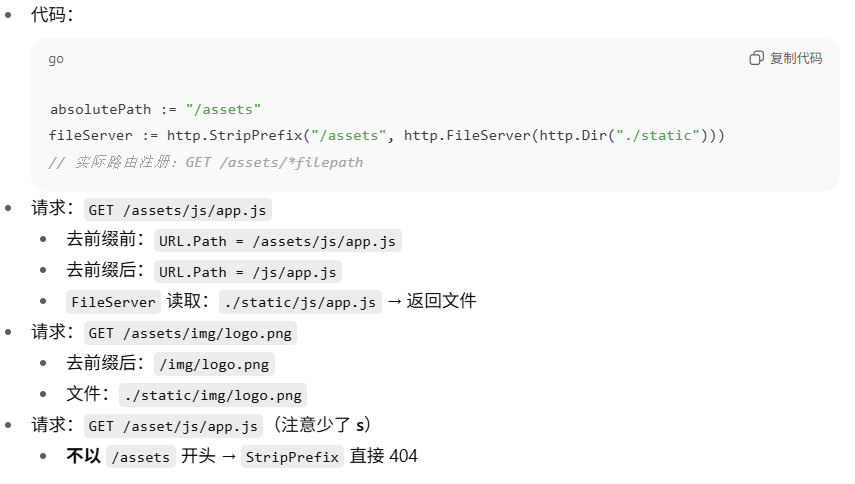
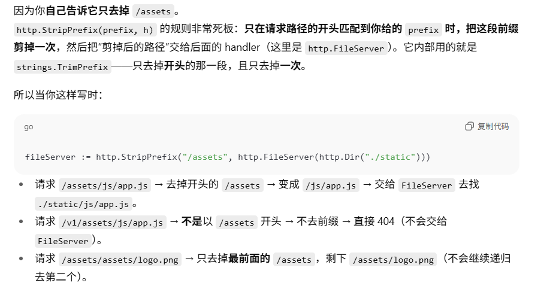
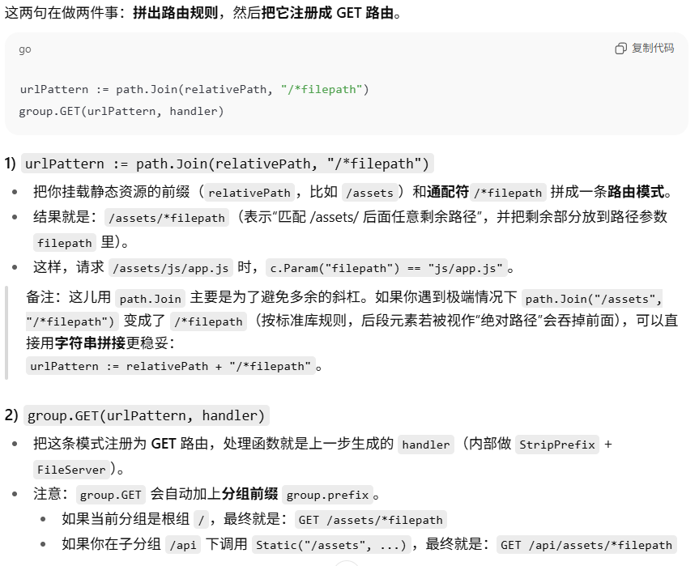
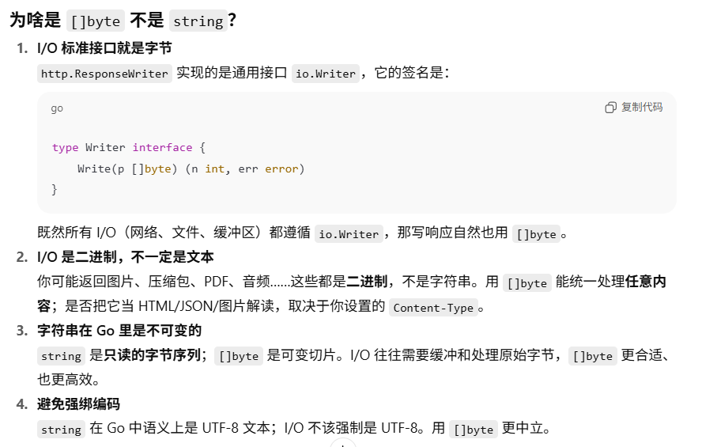
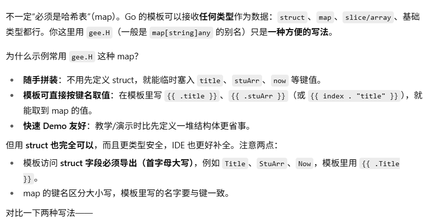
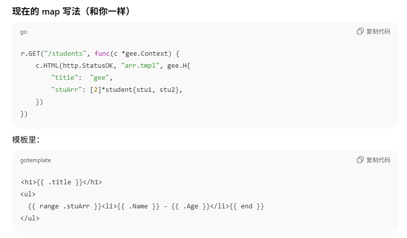
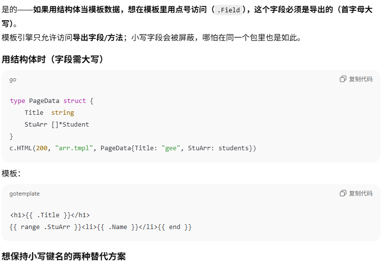
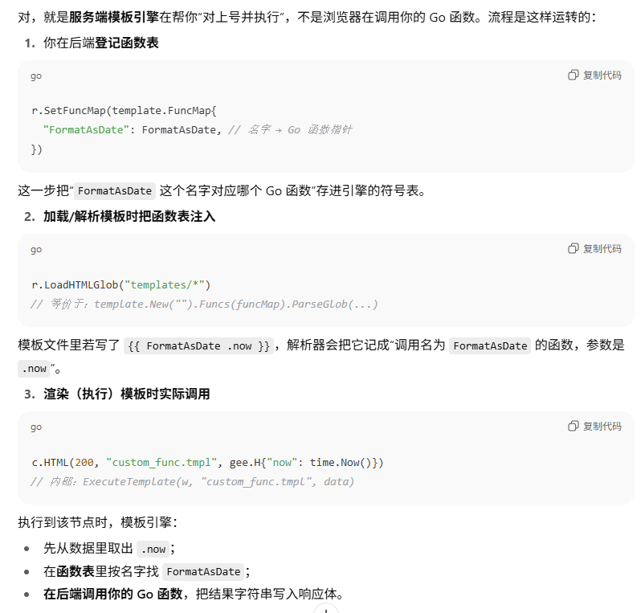
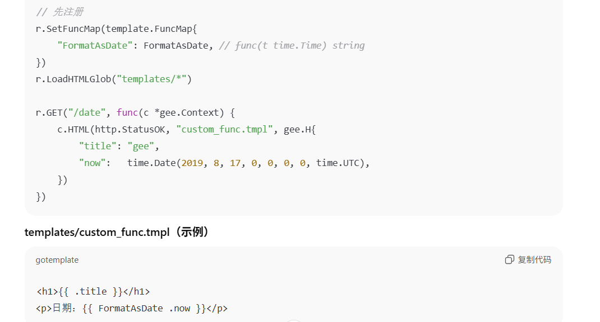
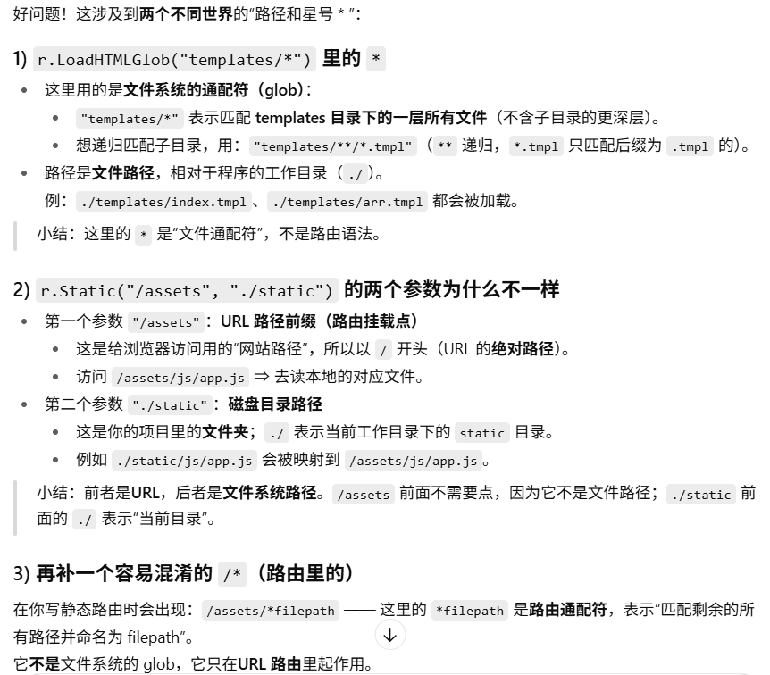

## Day06
两个渲染服务:

1. 静态文件服务 (Static Files)

在 RouterGroup 上新增：

Static(relativePath string, root string)

一个内部的 createStaticHandler(...)，用 http.FileServer + http.StripPrefix 实现。

路由规则形如：/assets/*filepath，把 URL 映射到磁盘目录（例如 ./static），访问 /assets/js/app.js 实际返回 ./static/js/app.js。
geektutu.com

2. HTML 模板渲染 (Template Rendering)

在 Engine 上新增字段与方法：

htmlTemplates *template.Template：缓存已解析的模板集合

funcMap template.FuncMap：注册自定义模板函数

SetFuncMap(funcMap template.FuncMap)：设置模板函数

LoadHTMLGlob(pattern string)：按通配符加载模板（需先 SetFuncMap 再加载）

修改 Context.HTML()：支持按模板名选择并渲染数据（使用 html/template，自动做 HTML 转义，防 XSS）。
geektutu.com
### 静态文件服务-Get返回
把服务器磁盘上的某个目录映射到 URL 前缀，按原样【不做处理】返回文件内容。
```go
func (group *RouterGroup) createStaticHandler(relativePath string, fs http.FileSystem) HandlerFunc {
	absolutePath := path.Join(group.prefix, relativePath)  // 组的路径+实际的静态资源挂载点（相对路径）的路径吗
	fileServer := http.StripPrefix(absolutePath, http.FileServer(fs)) //StripPrefix(A, FileServer(B)) = 遇到以 A 开头的 URL，去掉 A，再用 B 这个文件系统去找对应文件返回。
	return func(c *Context) {
		file := c.Param("filepath")  // 获得filepath的值实际上是对应的剩余路径-这里对应的是文件路径
		if _, err := fs.Open(file); err != nil {  // 如果路径存在
			c.Status(http.StatusNotFound)  // 直接结束
            panic("文件不存在!")
		}
        // 从磁盘读取文件、设置合适的 Content-Type 并写回响应。
		fileServer.ServeHTTP(c.Writer, c.Req)  // 交给标准库文件服务器读取并回写
	}
}
```
这里http.StripPrefix里的操作是先把请求 URL 的某个前缀去掉，再把“去前缀后的路径”交给静态文件服务器去读取返回.
这个函数具体理解如下:

这里去掉http.StripPrefix(prefix, h)前缀的逻辑:http.StripPrefix(prefix, h)
如果请求路径 r.URL.Path 以你给的 prefix 开头把这段 prefix 从开头剪掉，得到“剩余路径”，再把修改后的请求交给下游 h（比如 FileServer）。

**易错**:这里的绝对路径很有误导，实际上这里的绝对路径指的是URL的前面的部分路径
file := c.Param("filepath")  // 获得filepath的值实际上是对应的剩余路径-这里对应的是文件的存储路径
```go
func (group *RouterGroup) Static(relativePath string, root string) {  //这里的把磁盘目录 root 封成一个 http.FileSystem所处理的目录
	handler := group.createStaticHandler(relativePath, http.Dir(root))  // 生成真正的处理函数
	urlPattern := path.Join(relativePath, "/*filepath")
	group.GET(urlPattern, handler)
}
```

urlPattern := path.Join(relativePath, "/*filepath")  // 拼成一个通配模式-动态访问文件路径的

group.GET(urlPattern, handler)  // 给出对应的url路径和相应的处理函数(读取并返回/*filepath路径的静态文件数据)
### HTML模板
htmlTemplates *template.Template // “模板集合”：把磁盘上的多个模板文件解析后装进来
funcMap       template.FuncMap   // “模板函数表”：模板里可调用的自定义函数（如 upper、date）
设置模板函数
把你自定义的模板函数（template.FuncMap，本质是 map[string]any）存到 engine 上。
这些函数会在解析模板之前注入到模板里，供模板使用（比如 {{ upper .Name }}）。
```go
func (engine *Engine) SetFuncMap(funcMap template.FuncMap) {
    engine.funcMap = funcMap
}
```
按通配符加载（解析）模板
- SetFuncMap 先登记我们所使用的函数, LoadHTMLGlob 再带着这些函数去把模板都解析好，并缓存到 engine.htmlTemplates。
```go
func (engine *Engine) LoadHTMLGlob(pattern string) {
    engine.htmlTemplates = template.Must(
        template.New("").Funcs(engine.funcMap).ParseGlob(pattern),
    )
}
```
- template.New("")：创建一个空的“模板集合”（可容纳多个命名模板）。
- .Funcs(engine.funcMap)：把你通过 SetFuncMap 传进来的函数表注入到模板里，供模板中调用（例如 {{ upper .Name }}）。一定要在解析前调用，否则模板里会报“函数未定义。
- .ParseGlob(pattern)：使用通配符一次性解析多个文件（如 "templates/*.tmpl"、"templates/**/*.html"），把它们都放进这个集合里，后面可以用名字选择其中一个来渲染。
- 最后的template.Must(...) 其专门用来*在初始化阶段把“返回 (Template, error) 的结果”转换成“若有错就直接 panic”* 的形式。许多解析函数会返回：(*template.Template, error)，比如 Parse, ParseFiles, ParseGlob。如果你确定模板语法应该没问题，且希望一旦有错就让程序在启动时直接报错并退出，就用 template.Must(...) 包一下。template.Must(t, err) 的行为：
err == nil → 返回 t
err != nil → 直接 panic(err)（让错误在启动阶段暴露）
### HTML渲染
之前的HTML内容代码:c.Writer.Write([]byte(html))，因为核心在于 Go 的 I/O 抽象统一用“字节流”

而当前:
if err := c.engine.htmlTemplates.ExecuteTemplate(c.Writer, name, data); err != nil {
    c.Fail(500, err.Error()) 
}
ExecuteTemplate(c.Writer, name, data)：从已解析的模板集合里找到名为 name 的模板，用 data 作为数据渲染，并把结果直接写到 c.Writer
### 测试文件
```go
package main
import (
	"fmt"
	"html/template"
	"net/http"
	"time"

	"gee"
)

type student struct {
	Name string
	Age  int8
}

func FormatAsDate(t time.Time) string {  //传入时间
	year, month, day := t.Date()
	return fmt.Sprintf("%d-%02d-%02d", year, month, day)
}

func main() {
	r := gee.New()
	r.Use(gee.Logger())  //这个是创建对象的根函数
	r.SetFuncMap(template.FuncMap{  //内部是模板函数表
		"FormatAsDate": FormatAsDate,
	})
	//这里会将其所有的文件解析并放到同一个模板集合里-解析后，每个文件的基础文件名（不含路径）就是模板名
	r.LoadHTMLGlob("templates/*")  // 通配符加载并解析模板，扫描当前文件下的模板文件

	r.Static("/assets", "./static")  // 第一个url的相对路径，第二个文件内部的路径

	stu1 := &student{Name: "Geektutu", Age: 20}
	stu2 := &student{Name: "Jack", Age: 22}
	// 按照解析里查找
	r.GET("/", func(c *gee.Context) {
		c.HTML(http.StatusOK, "css.tmpl", nil)
	})
	r.GET("/students", func(c *gee.Context) {
		c.HTML(http.StatusOK, "arr.tmpl", gee.H{ // 哈希表
			"title":  "gee",
			"stuArr": [2]*student{stu1, stu2},
		})
	})

	r.GET("/date", func(c *gee.Context) {
		c.HTML(http.StatusOK, "custom_func.tmpl", gee.H{
			"title": "gee",
			"now":   time.Date(2019, 8, 17, 0, 0, 0, 0, time.UTC),
		})
	})

	r.Run(":9999")
}

```



易错:
1.数据的调用
```go
	r.GET("/students", func(c *gee.Context) {
		c.HTML(http.StatusOK, "arr.tmpl", gee.H{ // 哈希表
			"title":  "gee",
			"stuArr": [2]*student{stu1, stu2},
		})
	})
```

2.模板函数的使用-//这里依据模板里的函数调用，函数名称需保持一致
```go
	r.GET("/date", func(c *gee.Context) {
		c.HTML(http.StatusOK, "custom_func.tmpl", gee.H{
			"title": "gee",
			"now":   time.Date(2019, 8, 17, 0, 0, 0, 0, time.UTC),
		})
	})
```
注意这里注入的函数表就是引擎内结构体的变量:funcMap
engine.htmlTemplates = template.Must(template.New("").Funcs(engine.funcMap).ParseGlob(pattern))

其流程如下:

3.静态资源的使用
```go
r.GET("/", func(c *gee.Context) {
		c.HTML(http.StatusOK, "css.tmpl", nil)
})

```
**补充**：这里的c.Writer是HTTP 响应对象，这个ExecuteTemplate会将对应的模板是直接将HTML的内容返回给响应对象的响应体的。
响应行  协议版本+状态码+短语原因
响应头(响应的元信息) 内容类型、长度、缓存策略、跨域、压缩
响应体 数据内容
易错的路径:

注意这里，设立分组和路由是不一样，分组会默认执行中间件但是不会添加路由即有对应的响应
即访问分组都是404，因为浏览器没有对应的响应:
本质可以理解为添加分组只是添加一个函数，而添加一个路由映射则是添加了一个给浏览器响应的函数，因此访问分组的url只会404但是执行这个后台函数，但是访问这个路由对应的url，浏览器会有反应不会404.

分组（Group）：只是“前缀 + 中间件的容器”。创建分组/给分组 Use(...) 不会创建可响应的终点。
访问一个只建了分组、没建路由的 URL，最终是 404。
至于中间件会不会执行，看你的实现流程：在你这版 Gee 里，ServeHTTP 会先收集命中的分组中间件，然后进入 router.handle。

如果 router.handle 找不到路由却仍然调用了 c.Next()，那么中间件会执行，但最后仍返回 404。

如果 router.handle 找不到路由就直接写 404 并不再 c.Next()，那中间件也不会跑。
（Geektutu 的 Day05/06 常见写法是：收集中间件 → 尝试匹配 → 没匹配就写 404 → 仍 c.Next()，所以会先跑中间件，再得到 404。）

路由（Route）：GET/POST + pattern → handler，这是真正能给浏览器返回内容的终点。
访问匹配到的路由：执行“命中的分组中间件链”→ 执行路由的 handler → 正常返回（不是 404，除非你 handler 自己写了 404）。

一句话总结：
分组管“流程和前缀”，路由管“结果”。
只有注册了“路由映射”的 URL 才会有实际响应；仅有分组（哪怕挂了中间件）但没有对应路由，访问时的最终结果是 404（中间件是否跑，取决于你 router.handle 是否还会 c.Next()）。